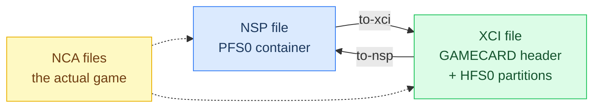
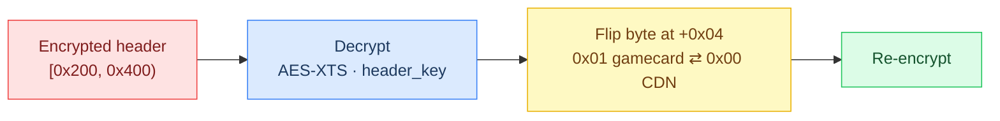

# nxconvert

Nintendo Switch container converter. Repacks NSP ↔ XCI losslessly, and — with your own prod.keys — rewrites the NCA distribution flag so converted files match their target format properly.

## Quick start (3 steps)

1. Install it (pick one):
   ```bash
   brew install kyungw00k/tap/nxconvert    # Homebrew (macOS/Linux)
   go install github.com/kyungw00k/nxconvert@latest  # Go
   go build -o nxconvert .                 # from source
   ```
2. `./nxconvert to-nsp game.xci` — writes `game.nsp` next to the input
3. `./nxconvert to-xci game.nsp --keys ~/.switch/prod.keys` — distribution rewritten to gamecard mode

Pure Go, zero external dependencies. Streams everything — a 26 GB XCI never touches RAM more than one buffer at a time (measured: 2 GB dump converts in 0.95 s).

## Commands

| Goal | Command |
|---|---|
| XCI → NSP | `nxconvert to-nsp input.xci [-o out.nsp]` |
| NSP → XCI | `nxconvert to-xci input.nsp [-o out.xci]` |
| Rewrite distribution flag | add `--keys <prod.keys>` to either (auto-discovered at `~/.switch/prod.keys`, `~/switch-prod.keys`, or `NXSHELF_PROD_KEYS`) |

Keys are read at runtime only — never embedded in the binary, never written to outputs.

## How it works

Conversion repacks the NCAs between containers — no re-signing, the payload never changes:



With `--keys`, each NCA header is additionally rewritten for the target distribution:



Content hashes and cnmt are unaffected — they cover the NCA body only, never the header.

## Validation (real cartridge dump, 2026-09)

- **Round-trip integrity**: XCI→NSP→XCI reproduces the original secure partition byte-for-byte (names, sizes, SHA-256 all identical)
- **Distribution rewrite**: CDN NSP→XCI with `--keys` produces decrypted headers matching the original cartridge XCI on every field (distribution 0x01 on both sides)
- Gamecard naming convention (filename = content hash) verified 4/4

Details: [docs/converter-validation.md](docs/converter-validation.md)

## Notes

- Use converted files only for personal backups. Cartridge-dump NCAs keep their gamecard titlekey encryption (bytes legitimately differ from CDN releases); installs work in Tinfoil/GoldLeaf/sigpatch environments.
- NSZ/XCZ (compressed containers) are not supported yet.
